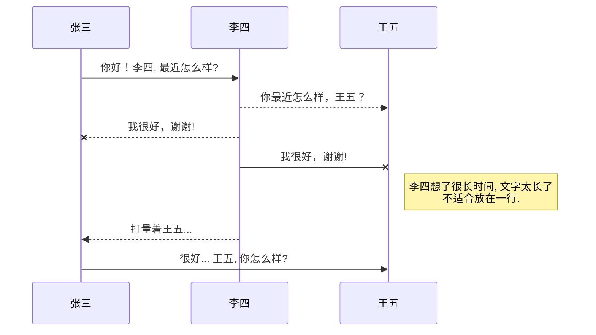
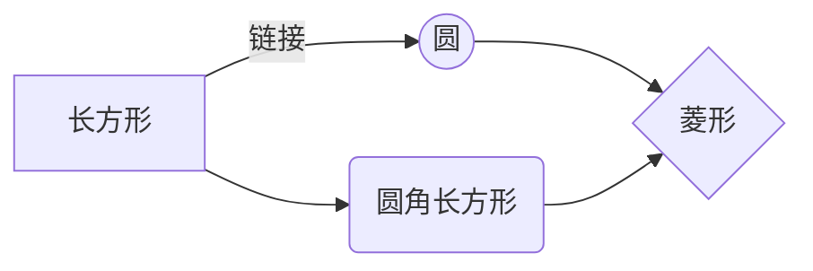

@[TOC](阿里云边缘计算使用学习)
# 前提准备

本文主要介绍基于阿里云边缘==C==版本SDK的使用，使传感器接入边缘计算网关并上传数据到阿里云。

## 编译环境搭建

Ubuntu开发环境下载链接：[Ubuntu18.04](http://releases.ubuntu.com/18.04.2/ubuntu-18.04.2-desktop-amd64.iso?_ga=2.69400208.1219817353.1560942601-1430411286.1560942601)

C版本SDK下载链接：[GitHub地址](https://github.com/aliyun/linkedge-thing-access-sdk-c/blob/master/docs/develop-guide.md)

在linux终端使用以下命令下载环境检测脚本，安装必须文件：
下载脚本：
`wget http://iotedge-web.oss-cn-shanghai.aliyuncs.com/public/testingTool/link-iot-edge_env-check.sh`
修改权限：
`sudo chmod +x ./link-iot-edge_env-check.sh`
执行脚本：
`sudo ./link-iot-edge_env-check.sh`

PS:当依赖项或缺少相关组件时最好使用使用`aptitude`

aptitude与 apt-get 一样，是 Debian 及其衍生系统中功能极其强大的包管理工具。与 apt-get 不同的是，aptitude在处理依赖问题上更佳一些。举例来说，aptitude在删除一个包时，会同时删除本身所依赖的包。这样，系统中不会残留无用的包，整个系统更为干净。

sudo aptitude install libmysqlclient-dev
`当出现无法安装情形参考此处：`[==点击查看==](https://www.cnblogs.com/aaron-agu/p/8862624.html)
运行后，**不接受未安装方案**，`接受降级方案`搞定。
## 开发环境依赖项
本SDK的开发编译环境使用如下软件: make-4.1, git-2.7.4, gcc-5.4.0, gcov-5.4.0, lcov-1.12, bash-4.3.48, tar-1.28, mingw-5.3.1


>先安装以下工具

```shell
sudo apt-get install -y aptitude
sudo aptitude  install -y build-essential make git gcc
```
`本工程依赖库的版本要保证和表格中列举版本一致或更高版本，否则将编译可能会失败`
==标识区==重点检查是否安装
Tool     | Version
-------- | -----:
gcc| 4.8.5+
==make==|3.82+
ld  | 2.17+
==cmake==|3.11.1+
autoconf	|2.69+
libtool	|2.4.6+
==zip==	|3.0+
**依赖组件**
Componet     | Version
-------- | :-----
cjson| 1.5.5+
==expat==|2.2.0+
==dbus==  |1.2.1+


**在边缘计算网关中部署实例...**


1.进入虚拟机，打开SDK文件：**cd** ==linkedge-thing-access-sdk-c/==

2.复制以下代码保存名为：**maintain.sh**文件

```shell
#!/bin/bash
RED_COLOR='\E[1;31m'   #红
GREEN_COLOR='\E[1;32m' #绿
YELOW_COLOR='\E[1;33m' #黄
BLUE_COLOR='\E[1;34m'  #蓝
PINK='\E[1;35m'        #粉红
RES='\E[0m'
pid=""
check_root_user() {
    if [ -z "$FC_NO_ISOLATION" ]; then
        local effective_uid=$("id" | grep -o "uid=[0-9]*" | cut -d= -f2)

        if [ $effective_uid -ne 0 ]
        then
            echo -e "\033[1;31mThe script needs to be run as root.\033[0m"
            exit 1;
        fi
    fi
}
usageFunc(){
    echo -e "${RED_COLOR}======input parameter error!======${RES}"
    echo -e "[ ${GREEN_COLOR}fctl${RES} ]==view the properties"
    echo -e "[ ${GREEN_COLOR}auto${RES} ]==make&&install"
    echo -e "[ ${GREEN_COLOR}check${RES} ]==check the build"
    echo -e "[ ${GREEN_COLOR}down${RES} ]==down the sample sdk"
    echo -e "[ ${GREEN_COLOR}driver${RES} ]==了解驱动运行状态"
    echo -e "[ ${GREEN_COLOR}dimu${RES} ]==了解设备上线异常"
    echo -e "[ ${GREEN_COLOR}data${RES} ]==了解设备上线成功后，如果设备数据上报有异"
	echo -e "[ ${GREEN_COLOR}restart 'pid'${RES} ]==重新启动驱动"
}

use_fctl(){
	echo -e "[ ${GREEN_COLOR}==view the properties==${RES} ]"
	cd /linkedge/gateway/build/bin/
	./fctl show
}
use_auto(){
	echo -e "[ ${GREEN_COLOR}==make&&install==${RES} ]"
	make clean
	make prepare && make && make install
}
use_check(){
	echo -e "[ ${GREEN_COLOR}==check the build==${RES} ]"
	ls -l build/bin/demo/led/
}
use_down(){
   if [[ -d ./linkedge-thing-access-sdk-c ]] ; then
     echo -e "${RED_COLOR}directory_exist!${RES}"
     echo -e "${PINK}======GO-->View======${RES}"
	   ls
	else
		git clone https://github.com/aliyun/linkedge-thing-access-sdk-c.git
		cd linkedge-thing-access-sdk-c/
	fi
}
use_driver(){
	echo -e "[ ${GREEN_COLOR}==了解驱动运行状态==${RES} ]"
	cd /linkedge/run/logger/fc-base/demo_driver
	ls -l
}
use_dimu(){
	echo -e "[ ${GREEN_COLOR}==了解设备上线异常==${RES} ]"
	cd /linkedge/run/logger/dimu
	ls -l
}
use_cloud_proxy(){
	echo -e "[ ${GREEN_COLOR}==了解设备上线成功后，如果设备数据上报有异==${RES} ]"
	cd /linkedge/run/logger/cloud-proxy
	ls -l
}
use_restart(){
	echo -e "[ ${GREEN_COLOR}==依据pid:$pid重新启动驱动==${RES} ]"
	kill -9 $pid
}
check_root_user	
if [[ $1 == "down" ]] ; then
	use_down
elif [[ $1 == "fctl" ]] ; then
	use_fctl
elif [[ $1 == "auto" ]] ; then
	use_auto
elif [[ $1 == "check" ]] ; then
  use_check
elif [[ $1 == "driver" ]] ; then
	use_driver
elif [[ $1 == "dimu" ]] ; then
	use_dimu
elif [[ $1 == "data" ]] ; then
	use_cloud_proxy
elif [[ $1 == "restart" ]] ; then
	if [[ $2 -ne "" ]] ; then
		pid="$2"
		use_restart
	else
		echo -e "${RED_COLOR}ERROR:pid为空!${RES}"
	fi
else
	usageFunc
fi
```
3.以上步骤完成后在此文件夹，鼠标右键选择在==terminal==打开

4.使用图中框选命令熟悉脚本功能，这里的功能可以参考阿里给个设备接入驱动开发文档。
浏览地址：[调试与发布](https://help.aliyun.com/document_detail/104444.html)

4.1假设未下载SDK文件可以，直接使用脚本进行下载：`sudo ./maintain.sh down`
就可以在当前文件夹看到下载的SDK文件夹`linkedge-thing-access-sdk-c`
4.2下载完成后再将miantain.sh文件移动到**linkedge-thing-access-sdk-c**里面
（可能新文件需要扩展权限：Linux 给文件夹或者文件增加权限==chmod -R 777 文件夹==）来参考以上步骤运行脚本~


 [^1]: [SDK阿里官方参考说明](https://help.aliyun.com/document_detail/104444.html)

## 调试驱动
1.云端添加驱动

1.1.云端添加驱动

1.2.云端添加驱动

1.3.设置哪些设备使用此驱动

1.4.部署
以上设置完成后，点击==部署==，这步需确定==边缘计算网关在线==

2.启动边缘计算网关，使其在线


2.1意外情况，边缘计算网关**无法在线问题**-->导致-->无法部署新驱动
通过命令==ifconfig==查看网络情况
==ping== www.baidu.com 查看外网连接情况！
- 当前虚拟机中外网连接有问题，而主机无问题，这时候最好重启下电脑，或者虚拟机尝试是否解决!
- 非边缘计算网关在线问题，其他问题导致的无法部署，建议直接查看部署日志，查看出错原因及时解决！


#  SDK功能解释及应用
详细请参考github上官方手册[地址](https://github.com/aliyun/linkedge-thing-access-sdk-c?spm=a2c4g.11186623.2.31.58f22377tI1n2E)
##  服务功能
==温湿度==设备物模型如下：

```json
{
  "services": [
    {
      "outputData": [
        {
          "identifier": "Result",
          "dataType": {
            "type": "bool"
          }
        }
      ],
      "identifier": "Power_Switch",
      "inputData": [
        {
          "identifier": "Power_Switch",
          "dataType": {
            "type": "bool"
          }
        }
      ]
    },
    {
      "outputData": [
        {
          "identifier": "Result_Time",
          "dataType": {
            "type": "bool"
          }
        }
      ],
      "identifier": "Setting_Period",
      "inputData": [
        {
          "identifier": "Period_Time",
          "dataType": {
            "type": "int"
          }
        }
      ]
    },
    {
      "outputData": [
        {
          "identifier": "result",
          "dataType": {
            "type": "bool"
          }
        }
      ],
      "identifier": "Env_Control",
      "inputData": [
        {
          "identifier": "Alarm_Temp",
          "dataType": {
            "type": "double"
          }
        }
      ]
    },
    {
      "outputData": [
        {
          "identifier": "result",
          "dataType": {
            "type": "bool"
          }
        }
      ],
      "identifier": "Env_Control_Humi",
      "inputData": [
        {
          "identifier": "Alarm_Humi",
          "dataType": {
            "type": "double"
          }
        }
      ]
    },
    {
      "outputData": [
        {
          "identifier": "result",
          "dataType": {
            "type": "enum"
          }
        }
      ],
      "identifier": "Over_Timeout",
      "inputData": [
        {
          "identifier": "Over_Timeout",
          "dataType": {
            "type": "int"
          }
        }
      ]
    }
  ],
  "properties": [
    {
      "identifier": "CurrentTemperature",
      "dataType": {
        "type": "double"
      }
    },
    {
      "identifier": "CurrentHumidity",
      "dataType": {
        "type": "double"
      }
    }
  ],
  "events": [
    {
      "outputData": [
        {
          "identifier": "error",
          "dataType": {
            "type": "enum"
          }
        }
      ],
      "identifier": "Faultreport",
      "type": "error"
    },
    {
      "outputData": [
        {
          "identifier": "AlarmType",
          "dataType": {
            "type": "enum"
          }
        },
        {
          "identifier": "CurrentTemperature",
          "dataType": {
            "type": "double"
          }
        }
      ],
      "identifier": "Temperature_Alarm",
      "type": "alert"
    },
    {
      "outputData": [
        {
          "identifier": "AlarmType",
          "dataType": {
            "type": "enum"
          }
        },
        {
          "identifier": "CurrentHumidity",
          "dataType": {
            "type": "double"
          }
        }
      ],
      "identifier": "Humidity_Alarm",
      "type": "alert"
    }
  ]
}
```

==网关设备==物模型如下：

```json
{
  "services": [
    {
      "outputData": [
        {
          "identifier": "result",
          "dataType": {
            "type": "enum"
          }
        }
      ],
      "identifier": "Over_Timeout",
      "inputData": [
        {
          "identifier": "Over_Timeout",
          "dataType": {
            "type": "int"
          }
        }
      ]
    },
    {
      "outputData": [
        {
          "identifier": "Result_Time",
          "dataType": {
            "type": "bool"
          }
        }
      ],
      "identifier": "Gateway_Setting_Period",
      "inputData": [
        {
          "identifier": "Period_Time",
          "dataType": {
            "type": "int"
          }
        }
      ]
    },
    {
      "outputData": [
        {
          "identifier": "Result",
          "dataType": {
            "type": "bool"
          }
        }
      ],
      "identifier": "Switch_Filtration",
      "inputData": [
        {
          "identifier": "Main_Switch_Filtration",
          "dataType": {
            "type": "bool"
          }
        }
      ]
    },
    {
      "outputData": [
        {
          "identifier": "Result",
          "dataType": {
            "type": "bool"
          }
        }
      ],
      "identifier": "Gateway_Power_Switch",
      "inputData": [
        {
          "identifier": "Power_Switch",
          "dataType": {
            "type": "int"
          }
        }
      ]
    },
    {
      "identifier": "Manul",
      "inputData": [
        {
          "identifier": "Manul",
          "dataType": {
            "specs": {
              "item": {
                "type": "int"
              },
              "size": "15"
            },
            "type": "array"
          }
        }
      ]
    }
  ]
}
```


```c
/*
*演示：接收云端服务调用
*/
static int call_service_callback_cb(device_handle_t dev_handle, 
                               const char *service_name, 
                               const leda_device_data_t data[], 
                               int data_count, 
                               leda_device_data_t output_data[], 
                               void *usr_data)
{
	const char *Service_dat1[]= {  //服务标识符匹配
	"Power_Switch",
	"Gateway_Power_Switch",
	"Gateway_Setting_Period",
	"Setting_Period",
	"Env_Control",
	"Env_Control_Humi",
	"Over_Timeout",
	"Switch_Filtration",
	"Manul"
								    };
	const char *Service_dat2[]= { //参数标识符匹配
	"Power_Switch",
	"Period_Time",
	"Alarm_Temp",
	"Alarm_Humi",
	"Alarm_Boiler",
	"Alarm_Negative_pressure",
	"Alarm_Co2",
	"Alarm_NH3",
	"Alarm_iLLumination",
	"Alarm_Position_Value",
	"Alarm_Water",
	"Alarm_Co",
	"Over_Timeout",
	"Main_Switch_Filtration",
	"Manul"
												};
    int i = 0;
		SNAI_Config *cnf = SNAI_cnf_read_config("/linkedge/run/SNAI_cnf.ini", '#', '=');
		char config_dev_n[12];								
		sprintf(config_dev_n,"485_DEV_%u",SNAI_ALL_DEVICE_REPORT.SNAI_485dev_ADDR[dev_handle]);
    /* service_name为该驱动物模型自定义方法名称 */
    log_i(LED_TAG_NAME, "service_name: %s\r\n", service_name);
    SNAI_DEBUG_INFO("service_name:【%s】",service_name);
    /* 获取service_name方法的参数名称和值信息 */
    for (i = 0; i < data_count; i++)
    {
        log_i(LED_TAG_NAME, "input_data %s: %s\r\n", data[i].key, data[i].value);
        SNAI_DEBUG_INFO("input_data:【%s】【%s】",data[i].key,data[i].value);
		for(int Service_N_c = 0;Service_N_c < 9;Service_N_c++)
			{
				if (!strcmp(service_name, Service_dat1[Service_N_c]))//匹配到服务名称
        		{
					for (int Service_K_c = 0;Service_K_c < 15;Service_K_c++)
					{
						if (!strcmp(data[i].key, Service_dat2[Service_K_c]))//匹配到输入参数名称
        				{
							if(Service_K_c == 0)
							{
								if(Service_N_c == 0)
								{
									SNAI_ALL_DEVICE_REPORT.SNAI_DEVICE_EXIST[SNAI_ALL_DEVICE_REPORT.SNAI_485dev_ADDR[dev_handle]] = atoi(data[i].value);//停止轮询
									SNAI_cnf_add_option(cnf, config_dev_n, Service_dat2[Service_K_c], data[i].value);									
									SNAI_DEBUG_INFO("设备:【%u】开关状态:【%d】",SNAI_ALL_DEVICE_REPORT.SNAI_485dev_ADDR[dev_handle],SNAI_ALL_DEVICE_REPORT.SNAI_DEVICE_EXIST[SNAI_ALL_DEVICE_REPORT.SNAI_485dev_ADDR[dev_handle]]);
								}
								if(Service_N_c == 1)
								{
									SNAI_Gateway_Power_Switch_Flag = atoi(data[i].value);//为0 /停止轮询，停止上报，停止解析一切数据 //=2停止主动轮寻
									SNAI_cnf_add_option(cnf, "485_Gateway", Service_dat2[Service_K_c], data[i].value);
									SNAI_DEBUG_INFO("网关开关状态:【%d】",SNAI_Gateway_Power_Switch_Flag);
								}
								if(SNAI_ALL_DEVICE_REPORT.SNAI_DEVICE_EXIST[SNAI_ALL_DEVICE_REPORT.SNAI_485dev_ADDR[dev_handle]] == 0)record_delete(SNAI_ALL_DEVICE_REPORT.SNAI_485dev_ADDR[dev_handle]);
								
							}
							if(Service_K_c == 1)
							{
								if (Service_N_c == 2)//网关的周期/s
								{
									sscanf(data[i].value,"%u",&SNAI_Period_Set.SNAI_Gateway_Report_Period);
									SNAI_cnf_add_option(cnf, "485_Gateway", Service_dat2[Service_K_c], data[i].value);
									SNAI_DEBUG_INFO("网关上报周期:【%uS】",SNAI_Period_Set.SNAI_Gateway_Report_Period);
								}
								if (Service_N_c == 3)//设备轮询周期/*1000=us
								{
									sscanf(data[i].value,"%u",&SNAI_Period_Set.SNAI_485dev_Polling_Period[SNAI_ALL_DEVICE_REPORT.SNAI_485dev_ADDR[dev_handle]]);
									SNAI_cnf_add_option(cnf, config_dev_n, Service_dat2[Service_K_c], data[i].value);
									SNAI_DEBUG_INFO("设备:【%u】轮询周期:【%ums】",SNAI_ALL_DEVICE_REPORT.SNAI_485dev_ADDR[dev_handle],SNAI_Period_Set.SNAI_485dev_Polling_Period[SNAI_ALL_DEVICE_REPORT.SNAI_485dev_ADDR[dev_handle]]);
								}
								record_update(SNAI_ALL_DEVICE_REPORT.SNAI_485dev_ADDR[dev_handle],SNAI_Period_Set.SNAI_485dev_Polling_Period[SNAI_ALL_DEVICE_REPORT.SNAI_485dev_ADDR[dev_handle]],0);
							}
							if(Service_K_c == 2 || Service_K_c == 3 || Service_K_c == 4)//报警值
							{
								if(Service_N_c == 5)//湿度报警值
								{
									SNAI_Alarm_value.SNAI_485dev_Alarm_DATA_Humi[SNAI_ALL_DEVICE_REPORT.SNAI_485dev_ADDR[dev_handle]] = atof(data[i].value);//485地址区分 -每个地址报警值
									SNAI_cnf_add_option(cnf, config_dev_n, Service_dat2[Service_K_c], data[i].value);
									SNAI_DEBUG_INFO("设备:【%u】湿度报警设定:【%.1f%%】",SNAI_ALL_DEVICE_REPORT.SNAI_485dev_ADDR[dev_handle],SNAI_Alarm_value.SNAI_485dev_Alarm_DATA_Humi[SNAI_ALL_DEVICE_REPORT.SNAI_485dev_ADDR[dev_handle]]);
								}
								else
								{
								SNAI_Alarm_value.SNAI_485dev_Alarm_DATA_TMP[SNAI_ALL_DEVICE_REPORT.SNAI_485dev_ADDR[dev_handle]] = atof(data[i].value);//485地址区分 -每个地址报警值
								SNAI_cnf_add_option(cnf, config_dev_n, Service_dat2[Service_K_c], data[i].value);
								SNAI_DEBUG_INFO("设备:【%u】温度报警设定:【%.1f℃】",SNAI_ALL_DEVICE_REPORT.SNAI_485dev_ADDR[dev_handle],SNAI_Alarm_value.SNAI_485dev_Alarm_DATA_TMP[SNAI_ALL_DEVICE_REPORT.SNAI_485dev_ADDR[dev_handle]]);
								}							
							}
							if(Service_K_c == 5 || Service_K_c == 6 || Service_K_c == 7 || Service_K_c == 8 || Service_K_c == 9 || Service_K_c == 11)//报警值
							{
								sscanf(data[i].value,"%u",&SNAI_Alarm_value.SNAI_485dev_Alarm_DATA_INT[SNAI_ALL_DEVICE_REPORT.SNAI_485dev_ADDR[dev_handle]]);
								if(SNAI_ALL_DEVICE_REPORT.SNAI_485dev_ADDR[dev_handle] == 11)
								{
									SNAI_cnf_add_option(cnf, config_dev_n, "Alarm_Position_Value_L", data[i].value);
								}
								else if(SNAI_ALL_DEVICE_REPORT.SNAI_485dev_ADDR[dev_handle] == 12)
								{
									SNAI_cnf_add_option(cnf, config_dev_n, "Alarm_Position_Value_R", data[i].value);
								}
								else
								{
									SNAI_cnf_add_option(cnf, config_dev_n, Service_dat2[Service_K_c], data[i].value);
								}
								SNAI_DEBUG_INFO("设备:【%u】报警设定:【%u】",SNAI_ALL_DEVICE_REPORT.SNAI_485dev_ADDR[dev_handle],SNAI_Alarm_value.SNAI_485dev_Alarm_DATA_INT[SNAI_ALL_DEVICE_REPORT.SNAI_485dev_ADDR[dev_handle]]);
							}
							if(Service_K_c == 10)
							{
								SNAI_Alarm_value.SNAI_485dev_Alarm_DATA_Water = atof(data[i].value);//485地址区分 -水表报警值
								SNAI_cnf_add_option(cnf, config_dev_n, Service_dat2[Service_K_c], data[i].value);
								SNAI_DEBUG_INFO("设备:【%u】水量报警设定:【%.2f】",SNAI_ALL_DEVICE_REPORT.SNAI_485dev_ADDR[dev_handle],SNAI_Alarm_value.SNAI_485dev_Alarm_DATA_Water);
							}

							if(Service_K_c == 12)
							{
								SNAI_Period_Set.SNAI_485dev_Filtration_Timeout_Period[SNAI_ALL_DEVICE_REPORT.SNAI_485dev_ADDR[dev_handle]] = atoi(data[i].value);//每个设备的过滤超时时间设置
								SNAI_cnf_add_option(cnf, config_dev_n, Service_dat2[Service_K_c], data[i].value);
								SNAI_DEBUG_INFO("设备:【%u】过滤超时设定:【%dmin】",SNAI_ALL_DEVICE_REPORT.SNAI_485dev_ADDR[dev_handle],SNAI_Period_Set.SNAI_485dev_Filtration_Timeout_Period[SNAI_ALL_DEVICE_REPORT.SNAI_485dev_ADDR[dev_handle]]);
							}
							if(Service_K_c == 13)
							{
								SNAI_Period_Set.SNAI_Main_Filtration_Flag = atoi(data[i].value);//启用网关过滤
								SNAI_cnf_add_option(cnf, "485_Gateway", Service_dat2[Service_K_c], data[i].value);
								SNAI_DEBUG_INFO("网关过滤启用状态:【%d】",SNAI_Period_Set.SNAI_Main_Filtration_Flag);
							}
							if(Service_K_c == 14)
							{
								int temp = 0;
								unsigned char temp_value[16] = {0};
								char temp_ch[1024] = {0};
								strcpy(temp_ch,data[i].value);
								SNAI_DEBUG_INFO("源数据:【%s】",temp_ch);
								if(SNAI_strip_comments(temp_ch, '#'))//去掉空格
								{
									SNAI_DEBUG_INFO("修剪后数据:【%s】",data[i].value);
									if ('[' == data[i].value[0] && ']' == data[i].value[strlen(data[i].value)-1]) {
										for(int count = 1; count < strlen(data[i].value)-1;count++)
											{
												if(data[i].value[count] == ',' || data[i].value[count] == 0x20)continue;
												temp_value[temp] = SNAI_hexCharToValue(data[i].value[count]);
												temp_value[temp] <<= 4;//MSB
												temp_value[temp] += SNAI_hexCharToValue(data[i].value[count+1]);
												count += 1;
												SNAI_DEBUG_INFO("接收自定义数据:【%02X】",temp_value[temp]);
												temp++;//数组下标
											}
									}
								}
								usart_tx(temp_value ,temp+1);//send;					
							}
							break;
						}
					}
				}
		}
    }
		SNAI_cnf_write_file(cnf, "/linkedge/run/SNAI_cnf.ini", "SNAI 485 DEVICE DRIVER CONFIG INFO"); // 将配置信息写入/linkedge/run/SNAI_cnf.ini文件
		SNAI_delete_config(cnf);
		free(cnf);
		cnf = NULL;
		SNAI_DEBUG_INFO("写入完成！");//调试用
    return LE_SUCCESS;
}
```
##  数据上报

```c
void* status_report(void* data)
{
    int i = 0;
    int Para_num = 0,temp = 0,Event_Name_num = 0,Event_Name_temp = 0,Event_Name_offset = 0;
		unsigned int Event_Para_offset = 0,Event_Par_temp = 0,Event_Para_count_temp = 0;//偏移--参数数量--末尾地址
    SNAI_circular_buffer *cb = (SNAI_circular_buffer *)(data);//调试用
    signal(SIGKILL,SNAI_driver_exit);
    /* 对已上线设备每隔2秒钟上报一次温度数据和事件 */
    while (1)
    {
			//SNAI_DEBUG_INFO("加锁！");//调试用
			pthread_mutex_lock(&SNAI_Decode_mutex_lock);
			//SNAI_DEBUG_INFO("挂起线程！");//调试用
			pthread_cond_wait(&SNAI_cond, &SNAI_Decode_mutex_lock);
			//SNAI_DEBUG_INFO("等待条件变量激活...");//调试用
    	if(SNAI_Gateway_Power_Switch_Flag != 0)
    	{
					//SNAI_DEBUG_INFO("条件变量激活！");//调试用
	        for (i = 0; i < g_dev_handle_count; i++)
	        {
							if(SNAI_ALL_DEVICE_REPORT.SNAI_DEVICE_EXIST[SNAI_ALL_DEVICE_REPORT.SNAI_485dev_ADDR[i]] == 1)
					{
	            if(SNAI_ALL_DEVICE_REPORT.SNAI_device_ready[i] == 1)
	            {
			      /* report device properties */
	              temp = SNAI_ALL_DEVICE_REPORT.Parameter_ptr[i]+SNAI_ALL_DEVICE_REPORT.Parameter_count[i];
					SNAI_DEBUG_INFO(">>>>>>>>>>>>>>>>>>>>>>>>>>>>>>>>>>>>>>>>>>>>>>>>>>>>>>");
				  //SNAI_DEBUG_INFO("设备【%u】【数据】最大偏移至数组下标【%d】",SNAI_ALL_DEVICE_REPORT.SNAI_485dev_ADDR[i],temp-1);//调试用
	              for(Para_num = SNAI_ALL_DEVICE_REPORT.Parameter_ptr[i];Para_num < temp;Para_num++)
			      {
					if(0 < strlen(dev_proper_data[Para_num].value))
					{
			            SNAI_DEBUG_INFO("上传时设备数值【%s】",dev_proper_data[Para_num].value);
			            SNAI_DEBUG_INFO("上传时设备字符数【%u】",strlen(dev_proper_data[Para_num].value));//交叉编译不同long unsigned
					}
	              }
				 SNAI_DEBUG_INFO("上传数据首地址:【%d】数量:【%d】",SNAI_ALL_DEVICE_REPORT.Parameter_ptr[i],SNAI_ALL_DEVICE_REPORT.Parameter_count[i]);
	             leda_report_properties(g_dev_handle_list[i],dev_proper_data+SNAI_ALL_DEVICE_REPORT.Parameter_ptr[i], SNAI_ALL_DEVICE_REPORT.Parameter_count[i]);
	             
				 //memset(dev_proper_data+SNAI_ALL_DEVICE_REPORT.Parameter_ptr[i],0,sizeof(dev_proper_data[0])*SNAI_ALL_DEVICE_REPORT.Parameter_count[i]);//不可瞎用，导致乱码！
	            
	            /* report device event */
					SNAI_DEBUG_INFO("|------------------设备号【%u】事件参数------------------|",SNAI_ALL_DEVICE_REPORT.SNAI_485dev_ADDR[i]);
					Event_Name_temp = SNAI_DEVICE_EVN_REPOR.Event_Name_ptr[i]+SNAI_DEVICE_EVN_REPOR.Event_Name_count[i];//首地址+参数个数=尾地址+1
					for(Event_Name_num = SNAI_DEVICE_EVN_REPOR.Event_Name_ptr[i]; Event_Name_num < Event_Name_temp; Event_Name_num++)//依据事件名个数循环
					{
						if(Event_Name_num == SNAI_DEVICE_EVN_REPOR.Event_Name_ptr[i])//如果第一个事件触发那么参数只有1个
						{
							Event_Name_offset += 1;
							Event_Par_temp = 1;
						}
						else //其他事件参数都为2个
						{
							Event_Name_offset += 2;
							Event_Par_temp = 2;
						}
						SNAI_DEBUG_INFO("设备号【%u】事件名轮寻次数+1",SNAI_ALL_DEVICE_REPORT.SNAI_485dev_ADDR[i]);
						if((SNAI_DEVICE_EVN_REPOR.SNAI_DEVICE_EVENT_TRIGGER[i] & 0x01) == 1)//从第一个事件开始检测，决定是否上报
						{
							SNAI_DEBUG_INFO("设备号【%u】事件任务轮进入+1",SNAI_ALL_DEVICE_REPORT.SNAI_485dev_ADDR[i]);
							Event_Para_count_temp = SNAI_DEVICE_EVN_REPOR.Event_Parameter_ptr[i]+Event_Name_offset;//加上事件变化偏移量
							SNAI_DEBUG_INFO("设备号【%u】原始【%u】当前总偏移至【%u】",SNAI_ALL_DEVICE_REPORT.SNAI_485dev_ADDR[i],Event_Para_count_temp-Event_Par_temp,Event_Para_count_temp-1);
							SNAI_DEBUG_INFO("设备号【%u】事件名【%s】参数数量【%u】",SNAI_ALL_DEVICE_REPORT.SNAI_485dev_ADDR[i],SNAI_DEVICE_EVN_REPOR.SNAI_DEVICE_EVENT_NAME[Event_Name_num],Event_Par_temp);
							
							for(Event_Para_offset = (Event_Para_count_temp-Event_Par_temp); Event_Para_offset < Event_Para_count_temp; Event_Para_offset++)//循环调试-->展示数据用
							{
							          SNAI_DEBUG_INFO("事件参数名【%s】事件上传时数值【%s】",dev_event_data[Event_Para_offset].key,dev_event_data[Event_Para_offset].value);
							         
							}
							//leda_report_event(g_dev_handle_list[i], SNAI_DEVICE_EVN_REPOR.SNAI_DEVICE_EVENT_NAME[SNAI_DEVICE_EVN_REPOR.Event_Name_ptr[i]+Event_Name_offset], dev_event_data, Event_Para_offset);//上报名称
							leda_report_event(g_dev_handle_list[i], SNAI_DEVICE_EVN_REPOR.SNAI_DEVICE_EVENT_NAME[Event_Name_num], dev_event_data+(Event_Para_count_temp-Event_Par_temp), Event_Par_temp);//上报名称	
							SNAI_DEBUG_INFO("上传事件首地址:【%d】偏移【%d】总数量:【%d】",Event_Para_count_temp-Event_Par_temp,Event_Par_temp-1,Event_Par_temp);
						}
						SNAI_DEVICE_EVN_REPOR.SNAI_DEVICE_EVENT_TRIGGER[i] >>= 1;//下一个事件检测
				          
					}
					Event_Name_offset = 0;
					SNAI_DEVICE_EVN_REPOR.SNAI_DEVICE_EVENT_TRIGGER[i] = 0;
					SNAI_ALL_DEVICE_REPORT.SNAI_device_ready[i] = 0;
			}
      else
      {
          //SNAI_DEBUG_INFO("*********设备【%u】未准备好数据，不上传！【线程号“%d”】*********",SNAI_ALL_DEVICE_REPORT.SNAI_485dev_ADDR[i],i);//调试用
      }
		}
			}
    	}
				//SNAI_DEBUG_INFO("解锁！");//调试用
				pthread_mutex_unlock(&SNAI_Decode_mutex_lock);
				
        if(SNAI_Period_Set.SNAI_Gateway_Report_Period == 0)
		{
			//SNAI_DEBUG_INFO("挂起本线程150ms！");//调试用
			usleep(150000);//最快上报频率
		}
		else
		{
					//SNAI_DEBUG_INFO("挂起本线程%us！",SNAI_Period_Set.SNAI_Gateway_Report_Period);//调试用
        	sleep(SNAI_Period_Set.SNAI_Gateway_Report_Period);//Origin_2s
		}
    }
}
```


## 如何改变文本的样式

*强调文本* _强调文本_

**加粗文本** __加粗文本__

==标记文本==

~~删除文本~~

> 引用文本

H~2~O is是液体。

2^10^ 运算结果是 1024.


##  注释也是必不可少的

Markdown将文本转换为 HTML。

*[HTML]:   超文本标记语言


## KaTeX数学公式

您可以使用渲染LaTeX数学表达式 [KaTeX](https://khan.github.io/KaTeX/):

Gamma公式展示 $\Gamma(n) = (n-1)!\quad\forall
n\in\mathbb N$ 是通过欧拉积分

$$
\Gamma(z) = \int_0^\infty t^{z-1}e^{-t}dt\,.
$$

> 你可以找到更多关于的信息 **LaTeX** 数学表达式[here][1].


## 自定义驱动功能实现顺序

```mermaid
gantt
        dateFormat  YYYY-MM-DD
        title 功能模块实现顺序
        section 功能名称
        串口驱动            :done,   des1, 2019-06-06,2019-06-10
        数据解析上报               :done,  des2, 2019-06-09, 6d
        报警信息上报               :done,  des3, after des2, 6d
        交互服务功能实现               :done,  des4, after des3,2d
        配置文件保存               :done,  des5, after4,2d
        本地设备信息数据库 :done,  des6, after5,2d
        接入其他平台    :    active, des7,after des6,10d
```

## UML 图表

可以使用UML图表进行渲染。 [Mermaid](https://mermaidjs.github.io/). 例如下面产生的一个序列图：:



这将产生一个流程图。:



- 关于 **Mermaid** 语法，参考 [这儿][3],

## FLowchart流程图

我们依旧会支持flowchart的流程图：
```mermaid
flowchat
st=>start: 开始
e=>end: 结束
op=>operation: 我的操作
cond=>condition: 确认？

st->op->cond
cond(yes)->e
cond(no)->op
```

- 关于 **Flowchart流程图** 语法，参考 [这儿][4].


## 导出与导入

###  导出
如果你想尝试使用此编辑器, 你可以在此篇文章任意编辑。当你完成了一篇文章的写作, 在上方工具栏找到 **文章导出** ，生成一个.md文件或者.html文件进行本地保存。

### 导入
如果你想加载一篇你写过的.md文件或者.html文件，在上方工具栏可以选择导入功能进行对应扩展名的文件导入，
继续你的创作。


  [1]: http://meta.math.stackexchange.com/questions/5020/mathjax-basic-tutorial-and-quick-reference
  [2]: https://mermaidjs.github.io/
  [3]: https://mermaidjs.github.io/
  [4]: http://adrai.github.io/flowchart.js/
